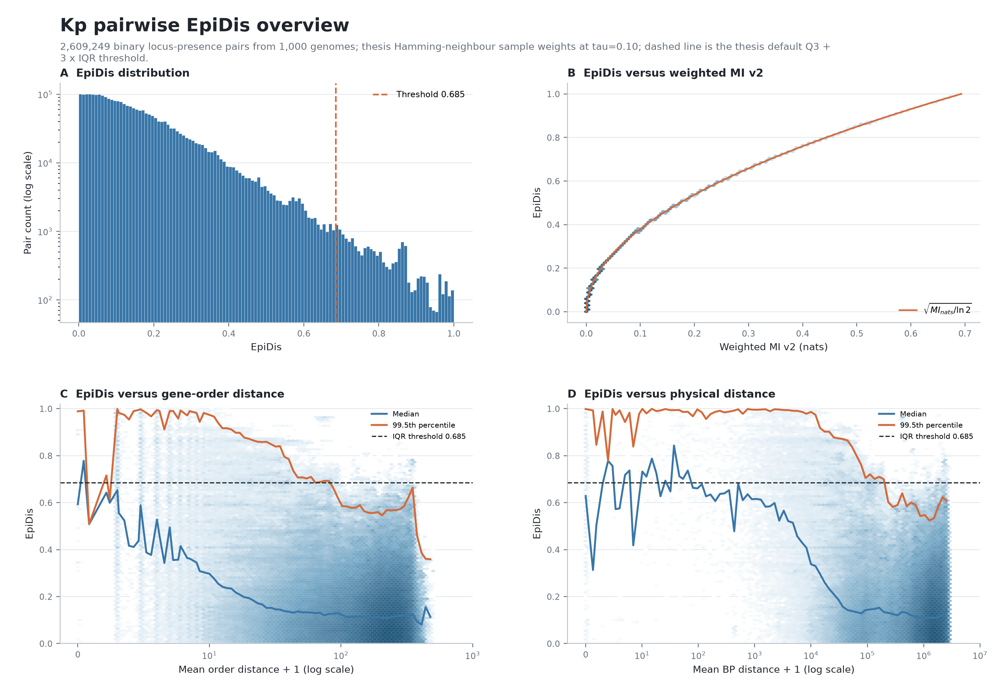
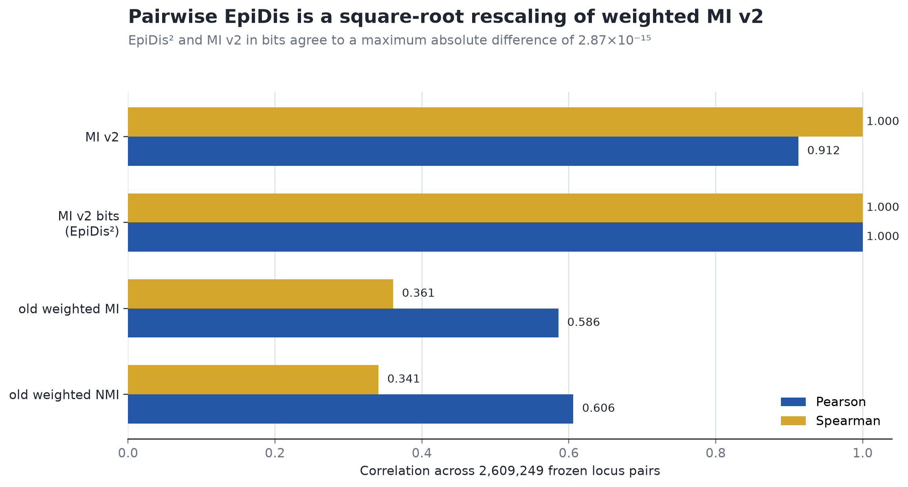

# Cinch dev2

> Research preview. Cinch reports phylogeny-aware statistical dependency candidates. A retained edge is not, by itself, molecular epistasis, a fitness interaction, or causality.



## What this repository is

Cinch dev2 packages the complete local Cinch methodology in a conventional Python repository while preserving the fast numerical kernels and frozen scientific definitions. It adopts the useful release conventions of the public Cinch WGS repository—an installable package, CLI, machine-readable workflow contract, continuous integration, checksums, documentation, and a static project site—without adopting its pure-Python mapper or pair-by-pair contingency implementation.

The repository contains no demonstration genomes, toy profiles, smoke-test datasets, raw research matrices, or private conversation export. Small frozen aggregate result tables are retained because they are required to audit the documented numerical claims.

## Scientific workflow

```text
genomes or allele profile
          |
          v
profile and pair-universe QC
          |
          +--> multiallelic cgMLST NMI --------+
          |                                     |
          +--> sample weights --> weighted MI --+--> physical-distance diagnostics
          |                                     |                 |
          +--> pairwise EpiDis -----------------+                 v
                                                    SHC-conditioned permutation
                                                               |
                                                               v
                                                            BH/FDR
                                                               |
                                                               v
                                                        ARACNE pruning
                                                               |
                                                               v
                                               conditional high-order Diff-GWES
```

The layers remain separate:

1. weighted MI and NMI quantify dependence;
2. pairwise EpiDis is the square root of weighted MI in bits under the frozen empirical-probability construction;
3. order and base-pair distances diagnose physical linkage;
4. SHC-conditioned permutations address population structure;
5. BH controls the tested-family false discovery rate;
6. ARACNE is post-test topology pruning, not a significance test;
7. Diff-GWES tests whether an A–B association changes across background C.

## Install

```bash
git clone https://github.com/Naclist/Cinch-dev2.git
cd Cinch-dev2
python -m venv .venv
source .venv/bin/activate
python -m pip install -e ".[test]"
pytest
```

The legacy WGS mapping stage additionally requires the external `configure` and `uberBlast` modules. They are deliberately optional: profile-based analysis, the statistical kernels, documentation, and tests do not depend on them.

## CLI

```bash
cinch-dev2 --version
cinch-dev2 doctor
cinch-dev2 list
cinch-dev2 verify
cinch-dev2 run -- --list-stages
cinch-dev2 run -- --track historical --dry-run
```

Production runs require explicit input files. The historical scripts retain the original Kp defaults for provenance, but users should pass `--profile`, `--pairs`, `--positions`, `--tree`, and metadata/annotation paths rather than relying on machine-specific defaults.

## Frozen results retained for audit

The retained Kp summary covers 1,000 genomes, 3,279 pair-universe loci, and 2,609,249 unique pairs. The accepted implementation reports:

- weighted-MI-v2 range: approximately `3.70e-14` to `0.693138` nats;
- EpiDis median: `0.117832`;
- EpiDis maximum: `0.999993`;
- EpiDis upper-outlier threshold: `Q3 + 3 IQR = 0.684741`;
- `EpiDis²` versus `MI_bits`: Pearson `1.0`, maximum absolute difference `2.87e-15`;
- true-data Diff-GWES: 351 eligible hypotheses, zero significant after correction;
- synthetic implementation benchmark: 20/20 planted truths and 0/20 predeclared negatives passed.



## Scientific result figures

The repository foregrounds result-bearing comparisons rather than decorative software diagrams:

| Question | Figure |
|---|---|
| How does EpiDis behave across the frozen pair universe and genomic distance? | [EpiDis overview](docs/figures/results/SCI01_EPIDIS_OVERVIEW.png) |
| How does EpiDis compare with the previous weighted MI/NMI workflow? | [old-vs-new comparison](docs/figures/results/SCI02_EPIDIS_VS_PREVIOUS_MI.png) |
| Do MI and NMI select the same distance-dependent tail? | [MI/NMI distance comparison](docs/figures/results/SCI03_MI_NMI_DISTANCE_COMPARISON.png) |
| What changes after population-structure conditioning? | [SHC correction diagnostics](docs/figures/results/SCI04_SHC_CORRECTION_DIAGNOSTICS.png) |
| How does per-gene allele diversity relate to same-allele phylogenetic mixing? | [allele diversity vs tree distance](docs/figures/results/SCI05_ALLELE_DIVERSITY_PHYLO_MIXING.png) |
| Where does the high-order hypothesis set shrink, and what survives? | [Diff-GWES attrition](docs/figures/results/SCI06_DIFF_GWES_ATTRITION.png) |
| What topology remains in the true-data SHC-strict network? | [conditional-MI communities](docs/figures/results/SCI07_TRUE_SHC_COMMUNITY_NETWORK.png) |
| How does the public Cinch SPN534 analysis compare tree, order, and physical bp distance? | [three-panel mean curves](docs/figures/results/SCI08_PUBLIC_CINCH_DISTANCE_MEAN_CURVES.png) · [density and availability diagnostics](docs/figures/results/SCI09_PUBLIC_CINCH_DISTANCE_DIAGNOSTICS.png) |

See [the figure index](docs/FIGURE_INDEX.md) for source provenance and interpretation limits.

The synthetic result tests implementation behavior under its construction. It is not evidence of biological power or specificity in natural populations.

## Repository map

| Path | Purpose |
|---|---|
| `src/cinch_dev2/core` | importable exact statistical primitives |
| `src/cinch_dev2/scripts/snapshots` | audited local analysis implementations |
| `src/cinch_dev2/scripts/cinch_pipeline.py` | staged workflow runner |
| `docs/methodology.md` | frozen method definitions and interpretation boundary |
| `docs/results-documentary.md` | accepted aggregate numerical results |
| `docs/FIGURE_INDEX.md` | scientific-figure provenance and interpretation limits |
| `docs/source-audit` | formula/code provenance and pair-universe contract |
| `docs/source-results` | small aggregate validation artifacts |
| `scripts/generate_figures.py` | source-backed validation-figure generator |
| `site` | static project site published by GitHub Pages |
| `CINCH_DEV2_FREEZE.yaml` | machine-readable scientific and release contract |

## Important boundaries

- The current frozen local profile contract treats `value > 0` as presence and non-positive/missing values as absence or non-callable. This is a documented limitation, not a general biological definition.
- The bundled `Cinch_v8.py` frontend depends on external mapping wrappers and is retained as an audited snapshot, not silently replaced with a weaker mapper.
- Pairwise EpiDis and weighted MI v2 have the same ordering under the frozen construction.
- Raw upper-tail membership is not evidence of remote interaction; the strongest tail is enriched for physically adjacent loci.
- Inverse-neighbour weighting does not by itself remove population structure.
- The high-order workflow uses held-out validation and within-SHC permutation; it does not authorize causal interpretation.

## Documentation

- [Scientific narrative](docs/SCIENTIFIC_NARRATIVE.md)
- [Inputs and state semantics](docs/INPUTS.md)
- [Outputs and interpretation](docs/OUTPUTS.md)
- [Performance architecture](docs/PERFORMANCE.md)
- [Development history and borrowed release conventions](docs/DEVELOPMENT_HISTORY.md)
- [Original frozen methodology](docs/methodology.md)
- [Result documentary](docs/results-documentary.md)

## References

- Pensar J, Puranen S, Arnold B, et al. Genome-wide epistasis and co-selection study using mutual information. *Nucleic Acids Research*. 2019;47:e112. [doi:10.1093/nar/gkz656](https://doi.org/10.1093/nar/gkz656)
- Margolin AA, Nemenman I, Basso K, et al. ARACNE. *BMC Bioinformatics*. 2006;7(Suppl 1):S7. [doi:10.1186/1471-2105-7-S1-S7](https://doi.org/10.1186/1471-2105-7-S1-S7)
- Lin J. Divergence measures based on the Shannon entropy. *IEEE Transactions on Information Theory*. 1991;37:145–151. [doi:10.1109/18.61115](https://doi.org/10.1109/18.61115)
- Benjamini Y, Hochberg Y. Controlling the false discovery rate. *JRSS B*. 1995;57:289–300. [doi:10.1111/j.2517-6161.1995.tb02031.x](https://doi.org/10.1111/j.2517-6161.1995.tb02031.x)
- Zhou Z, Charlesworth J, Achtman M. HierCC. *Bioinformatics*. 2021;37:3645–3646. [doi:10.1093/bioinformatics/btab234](https://doi.org/10.1093/bioinformatics/btab234)

## License status

No redistribution license has been selected. Public source visibility, if enabled later, is not a grant of reuse rights. See [LICENSE_STATUS.md](LICENSE_STATUS.md).
